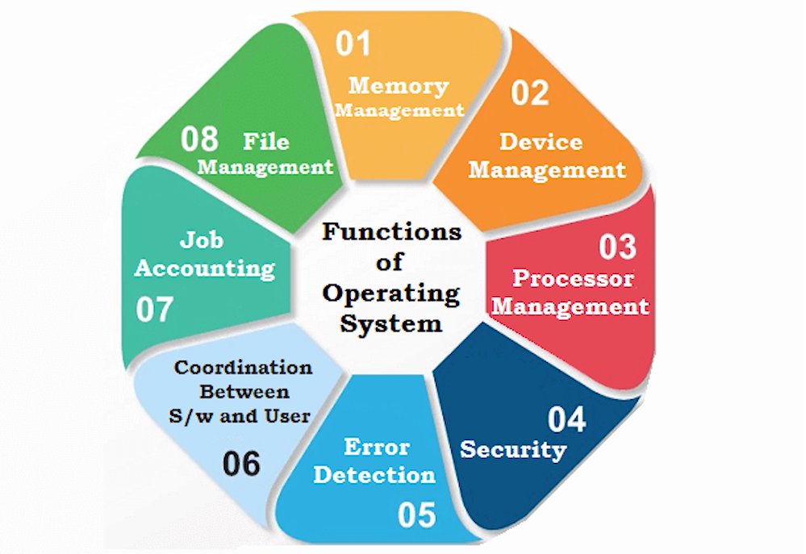
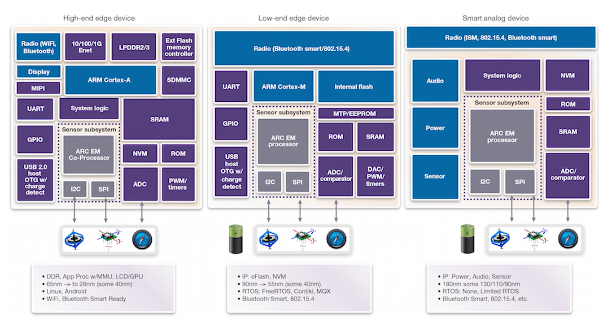
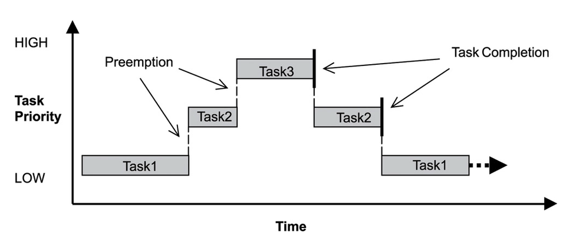

### What is a Real Time Operating System

A Real-Time Operating System (RTOS) is an OS designed to handle tasks within strict timing constraints. It ensures that tasks execute predictably and on time, making it ideal for embedded systems, robotics, and critical applications like automotive, medical devices, and industrial automation.



The purpose of an operating system is to provide an interface between software applications and the underlying hardware infrastructure

Difference between an OS and RTOS

**What is the need for RTOS in IoT**

The demands of an increasingly data-driven world mean that your IoT device will require robust and reliable software and RTOS is will be the engine powering the Internet of Things.

**Advantages of using RTOS in project**

1. Priority Based Scheduling is a powerful tool to separate critical processing from non-critical.
2. Task Based API in RTOS make modular development a breeze.  This also allows for easier testing cycles during product development. The task-based system also allows separate designers to work independently on their parts of the project.
3. Code Reusability is also an added advantage of the task-based system.
4. An RTOS can be entirely event-based and so no processing time is wasted polling for events that have not occurred.
5. A separate task is allocated for background processing called idle task, that ensure that things like CPU load measurement, Background Error Checking, etc.won't affect the main processing.



### FreeRTOS Implementation in the ESP32

**What is FreeRTOS**
FreeRTOS is a lightweight, open-source Real-Time Operating System (RTOS) designed for microcontrollers (MCUs) and small embedded systems. It provides task scheduling, inter-task communication, timers, and memory management while maintaining a low footprint.

**Some common terminologies in FreeRTOS**
1. **Scheduler**: As its name suggests, it manages how and when a set of programmed instructions must be executed.
2. **Thread**: A thread is the smallest sequence of programmed instructions that can be managed independently by a scheduler.
3. **Task**: It is a type of thread that can pause while waiting for an event to occur.
4. **Interrupt Service Routine**: ISR is a thread initiated by a hardware interrupt.
5. **Idle Task**: It is the lowest priority thread that only runs when no other thread is ready to execute.
6. **Blocked**: A task is said to be blocked if it is waiting on resources and not consuming any of the CPU.

The FreeRTOS uses a scheduler called a “Preemptive Scheduler”. With a preemptive scheduler,

A running thread continues to run until either of the following things happen:
- The thread finishes execution
- A high priority task becomes ready
- A thread gives up the processor while waiting for a resource

FreeRTOS in ESP32 and why we need it

### What are Task, Queues and Semaphores

The benefit of using FreeRTOS is that it allows the software application to be written as a set of independent tasks with each task having its own priority level. Other than the concept of tasks in FreeRTOS, there are



## **🔹 Understanding Tasks, Queues, and Semaphores in FreeRTOS**  
In **FreeRTOS**, tasks, queues, and semaphores are key components used to manage **multitasking, communication, and synchronization**.

---

## **1️⃣ What is a Task? (Thread in RTOS)**
A **task** in FreeRTOS is like a **thread** in an operating system. It is an independent function that runs concurrently with other tasks.  

🔹 **Key Features**:  
✅ Each task has **its own stack & execution context**.  
✅ Tasks run **based on priority** (higher-priority tasks run first).  
✅ **Preemptive scheduling** allows the highest priority task to run first.  

### **📌 Example: Creating Two Tasks**
```c
void Task1(void *pvParameters) {
    while (1) {
        printf("Task 1 Running\n");
        vTaskDelay(pdMS_TO_TICKS(1000)); // Delay 1 sec
    }
}

void Task2(void *pvParameters) {
    while (1) {
        printf("Task 2 Running\n");
        vTaskDelay(pdMS_TO_TICKS(500)); // Delay 500ms
    }
}

int main() {
    xTaskCreate(Task1, "Task1", 128, NULL, 2, NULL);
    xTaskCreate(Task2, "Task2", 128, NULL, 1, NULL);
    vTaskStartScheduler(); // Start FreeRTOS
}
```
🔹 **Task 1 has higher priority (2), so it runs first**.  
🔹 **Task 2 runs when Task 1 sleeps (`vTaskDelay`)**.  

---

## **2️⃣ What is a Queue? (Inter-Task Communication)**
A **queue** is a **FIFO (First-In-First-Out) buffer** used to send data between tasks **safely**.  

🔹 **Key Features**:  
✅ **Thread-safe** for inter-task communication.  
✅ Can **hold multiple items** (e.g., sensor data, commands).  
✅ Tasks can **send (`xQueueSend`) and receive (`xQueueReceive`) data**.  

### **📌 Example: Sending Data Between Tasks Using a Queue**
```c
QueueHandle_t queue; // Declare queue

void SenderTask(void *pvParameters) {
    int data = 100;
    while (1) {
        xQueueSend(queue, &data, portMAX_DELAY);
        vTaskDelay(pdMS_TO_TICKS(1000));
    }
}

void ReceiverTask(void *pvParameters) {
    int receivedData;
    while (1) {
        if (xQueueReceive(queue, &receivedData, portMAX_DELAY)) {
            printf("Received: %d\n", receivedData);
        }
    }
}

int main() {
    queue = xQueueCreate(5, sizeof(int)); // Create queue with 5 items
    xTaskCreate(SenderTask, "Sender", 128, NULL, 2, NULL);
    xTaskCreate(ReceiverTask, "Receiver", 128, NULL, 1, NULL);
    vTaskStartScheduler();
}
```
🔹 **SenderTask** places `100` into the queue every second.  
🔹 **ReceiverTask** fetches and prints the value.  

---

## **3️⃣ What is a Semaphore? (Synchronization Mechanism)**
A **semaphore** is used for **task synchronization and resource sharing**. It prevents **race conditions** when multiple tasks access shared resources.  

### **🔹 Types of Semaphores**  
✅ **Binary Semaphore** → Used for signaling (e.g., **task synchronization**).  
✅ **Counting Semaphore** → Allows **limited resource access** (e.g., max 3 tasks using a resource).  
✅ **Mutex (Mutual Exclusion)** → Prevents **data corruption** in shared resources.  

### **📌 Example: Using a Binary Semaphore for Synchronization**
```c
SemaphoreHandle_t semaphore; // Declare semaphore

void TaskA(void *pvParameters) {
    while (1) {
        printf("Task A waiting...\n");
        xSemaphoreTake(semaphore, portMAX_DELAY);
        printf("Task A running!\n");
        vTaskDelay(pdMS_TO_TICKS(1000));
        xSemaphoreGive(semaphore);
    }
}

void TaskB(void *pvParameters) {
    while (1) {
        xSemaphoreTake(semaphore, portMAX_DELAY);
        printf("Task B running!\n");
        vTaskDelay(pdMS_TO_TICKS(1000));
        xSemaphoreGive(semaphore);
    }
}

int main() {
    semaphore = xSemaphoreCreateBinary(); // Create binary semaphore
    xSemaphoreGive(semaphore); // Initialize semaphore

    xTaskCreate(TaskA, "TaskA", 128, NULL, 2, NULL);
    xTaskCreate(TaskB, "TaskB", 128, NULL, 1, NULL);

    vTaskStartScheduler();
}
```
🔹 **Task A & B take turns accessing the critical section**.  
🔹 **xSemaphoreTake() blocks a task until the resource is free**.  
🔹 **xSemaphoreGive() releases the semaphore after use**.  

---

## **🔹 Summary**
| Feature  | Task | Queue | Semaphore |
|----------|------|-------|----------|
| **Purpose** | Run code in parallel | Send data between tasks | Synchronize tasks & control shared resources |
| **Example** | LED blinking, sensor reading | Sending sensor data | Controlling I2C/SPI access |
| **Type** | Independent execution unit | FIFO buffer | Binary, Counting, Mutex |
| **Blocking?** | No | Yes (if queue full/empty) | Yes (if semaphore not available) |

---