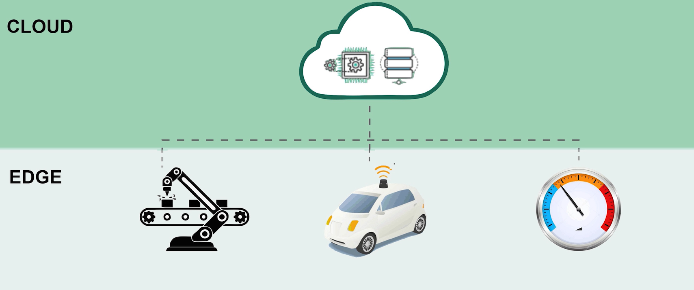
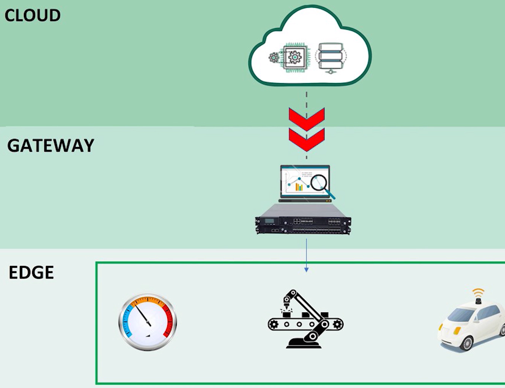
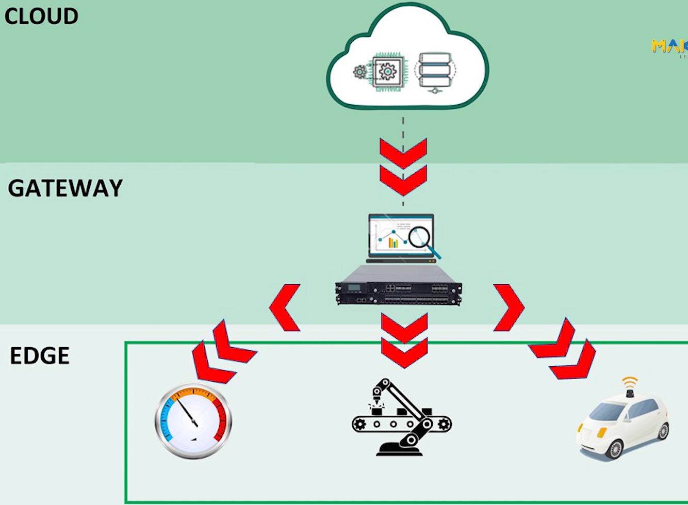
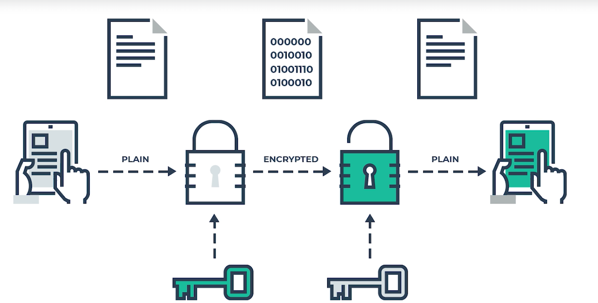
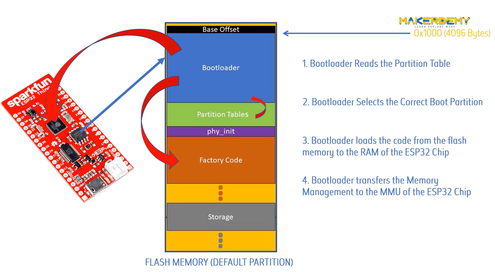
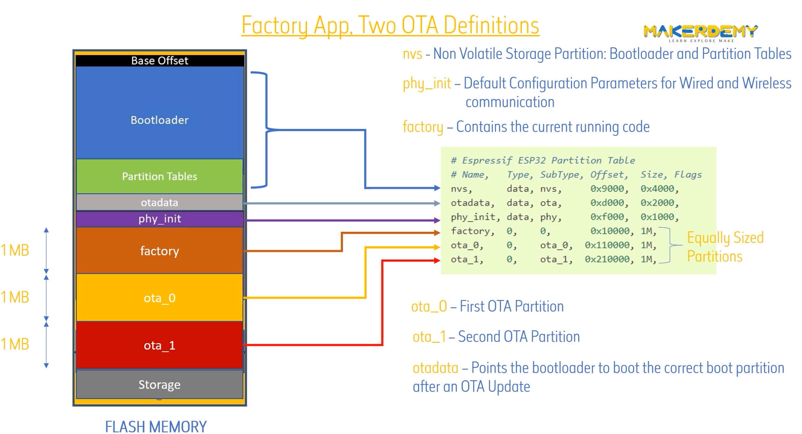

### What is OTA programming?

✅ An OTA update allows a device to receive firmware updates remotely using wireless or wired communication (Wi-Fi, Bluetooth, Ethernet, LoRa, etc.).

✅ This eliminates the need for physical access, making it ideal for IoT and remote systems.

📌 Example: Updating firmware on smart home devices (like an ESP32-based thermostat) without opening the device.


**The OTA features and drawbacks**


**OTA Architectures for IOT Systems**

1. Edge to Cloud OTA Architecture

In this Architecture, an internet-connected microcontroller, also known as an Edge device, is capable of receiving new firmware files from a remote server.



2. Gateway to Cloud OTA Architecture

In this architecture, an internet-connected gateway, is responsible for managing a fleet of local edge devices



3. Edge to gateway to Cloud Architecture

An internet-connected gateway is responsible for managing a fleet of locally connected edge devices, which in turn are capable of receiving remote firmware update via gateway.

In this architecture, the edge devices are independently capable of receiving updates.



**Design Consideration for implementing OTA**
1. Automatic Recovery: 

OTA updates should be atomic, either succeeding completely or failing gracefully in a recoverable manner. A failed update should be capable of rolling back to the previous stable version, and no update should have the ability to disable a device’s connection to the update server and preventing further updates from being pushed.

2. Encrypted OTA Channel

All OTA updates should be performed over encrypted communication channels. This should include TLS connection between the cloud and internet-connected gateway or edge. 

It should also include a TLS connection in the local connection between the gateway and its edge devices.



3. Code Integrity Check

Cryptographic code signing must be used to confirm that connected devices only accept code from verified authors and that the code hasn’t been altered in transit.

4. Code compatibility Check

If multiple Microcontroller architectures are used in an IoT System, a code compatibility checking feature must be incorporated before applying the update.

5. Partial Update Support

To decrease both bandwidth consumption and on-device processing time, partial updates should be supported so that only the changes to a firmware image need to be transmitted and applied to a given device.

### How do OTA Update happen in the ESP32

When the ESP32 board is powered up, initially the control is given to 4096 bytes position in the flash memory called the "bootloader". The responsibility of the bootloader is to select the correct partition to boot, based on the partition table, then load this code to RAM of the ESP32 chip and finally transfer the memory management to the memory Management.



By default there is no partition for OTA update

```python
# ESP-IDF Partition Table
# Name,   Type, SubType, Offset,  Size, Flags
nvs,      data, nvs,     0x9000,  0x6000,
phy_init, data, phy,     0xf000,  0x1000,
factory,  app,  factory, 0x10000, 1M,
```
`nvs`-Non Volatile Storage Partition: Booloader and Partition Tables.

`phy_init`-Default Configuration Parameters for Wired and Wireless communication.

`factory`-Contains the current running code


